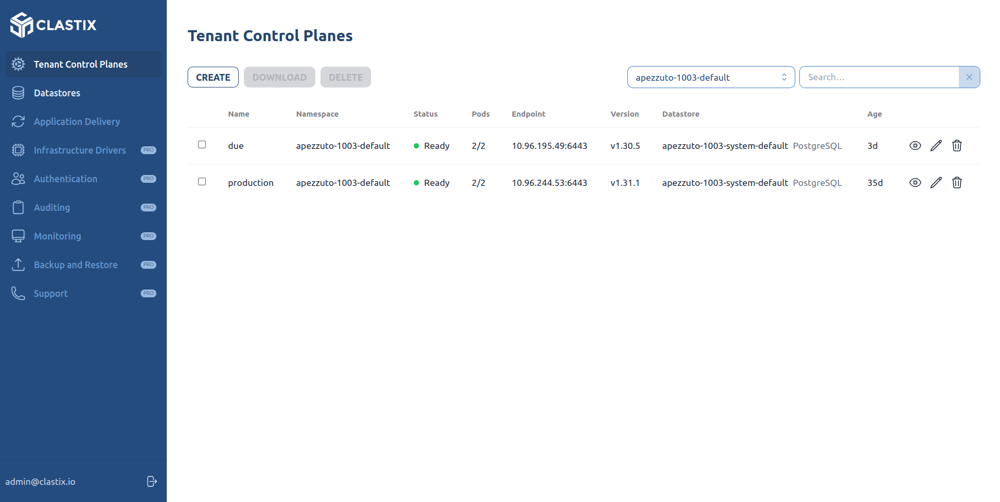

# Clastix Dashboard

View and control Kamaji with a simple user interface from the web.



## How to use

Create a `.env` file with the information contained in [.env.example](.env.example)

```bash
$ npm install
$ npm run dev
```

The dashboard should be run in an environment with a default connection to kubenretes API.

## Storybook

This repo contains visual UI tests using storybook. To run storybook

```bash
$ npm run storybook
```

## Features

1. Login with credentials or social login
2. Connect to TCP control plan`

## Deploy on Kubernetes

A sample manifest is available: `./deploy/kamaji-dashboard.yaml`. To deploy the dashboard in the admin cluster, edit the manifest according to your environment and apply:

```bash
kubectl apply -f deploy/
```

Assuming you have an Ingress Controller in place, the dashboard will be published as `https://kamaji.labs.clastix.io/ui`.

Enjoy!

## Connect to a child cluster

When reading child cluster resources, such as node, the dashboard uses the TCP kubeconfig in order to connect to the child cluster.
When running in dev mode, using `npm run dev`, the dashboard uses raw kubeconfig to connect to the cluster, in this way you should check that the child kubernetes API are reachable from your local development tool.

When build and deployed using docker, the dashboard supposes to be runned inside parent kubernetes cluster, so it connects to the TCP using the tcp service fqdn in order to talk with child cluster kubernetes api.
